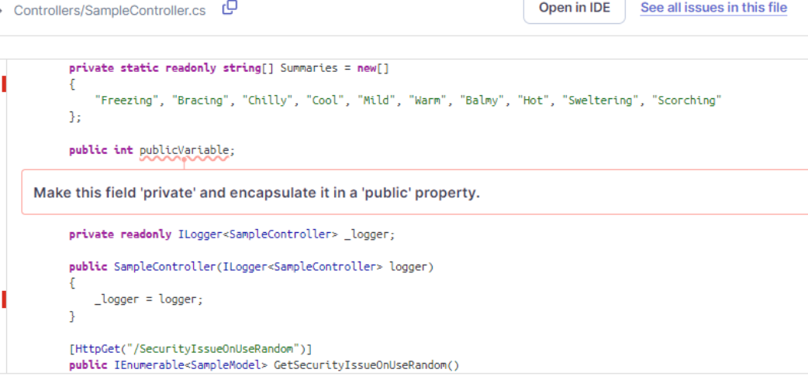
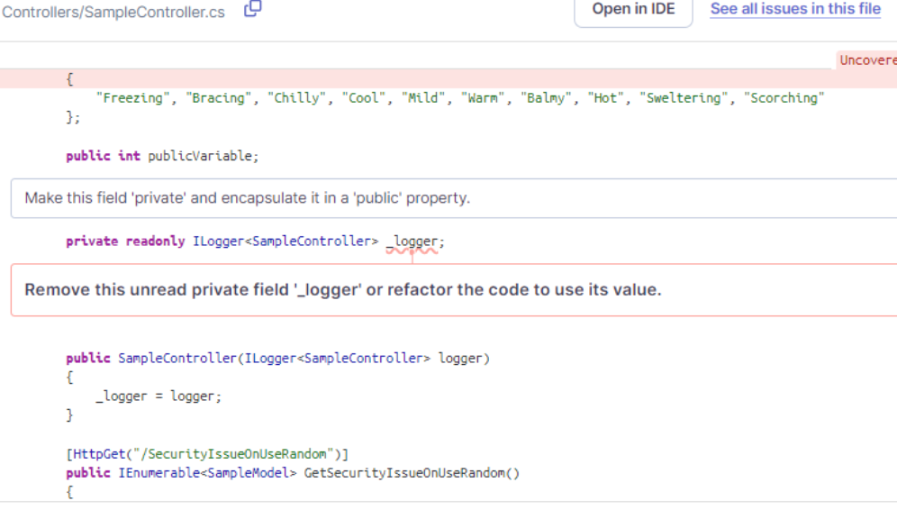
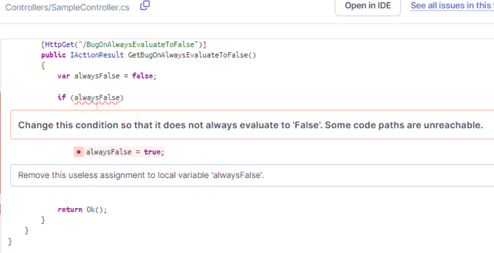

## Overview

SonarQube é uma plataforma de código aberto utilizada para garantir a qualidade do código em projetos de desenvolvimento de software. Ele realiza análises automáticas do código-fonte para detectar bugs e vulnerabilidades de segurança. Além disso, o SonarQube oferece métricas detalhadas sobre a manutenibilidade, a eficiência e a cobertura dos testes do código, ajudando as equipes a manter um alto padrão de qualidade de software ao longo do tempo.

## Prints da execução

